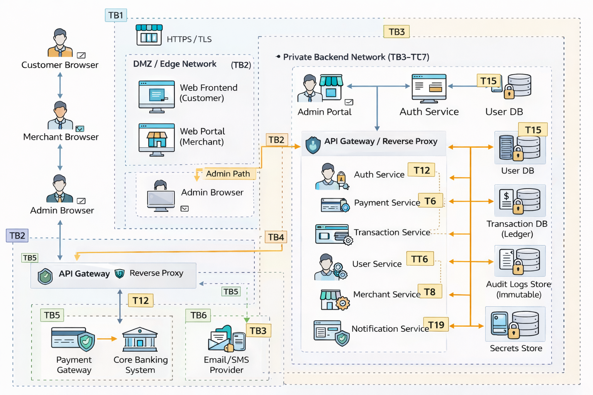
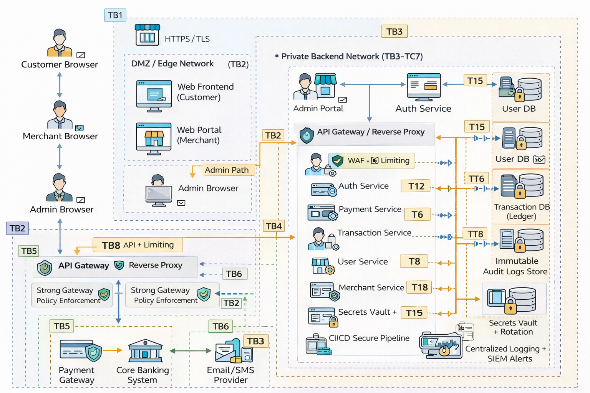

Online Payment Processing System
Secure Architecture & Threat Modeling Report

1. Executive Summary

This report presents a secure architecture design and structured threat model for an internet-facing Online Payment Processing Application.
The system processes customer payments, integrates with an external payment gateway and core banking system, and provides merchant and administrative portals.
Due to its financial nature and exposure to both external and insider threats, the system requires strong controls for confidentiality, integrity, availability, and accountability.
This document identifies critical assets, models threats using STRIDE, proposes architectural security controls, and evaluates residual risk.

2.1 Application Purpose
The system enables:
Customers to initiate payments
Merchants to view transactions and settlements
Administrators to manage refunds, disputes, and system configuration
Integration with payment gateway and core banking system

The system is assumed to be:
Internet-facing
Cloud-agnostic
Subject to both insider and external threats

2.2 High-Level Architecture

Architecture Description

The system consists of:
  Web Frontend (Customer + Merchant)
  Admin Portal
  API Gateway (edge entry point)
  Backend Services (Auth, Payment, Merchant, User, Transaction)
  Databases (User, Merchant, Transaction Ledger)
  Audit Log Storage
  Secrets Store
  External Integrations (Payment Gateway, Core Banking, Email/SMS)

Trust boundaries exist between:
  Internet and edge layer
  Edge and backend services
  Backend and data storage
  Backend and external systems
  Admin plane and user plane

3. Asset Inventory

The following critical assets were identified:
  User credentials
  Merchant data
  Transaction ledger
  Payment tokens
  Admin accounts
  Secrets and API keys
  Audit logs
  Core banking integration

Security Objectives

Assets were mapped to:
  Confidentiality
  Integrity
  Availability
  Accountability
  Financial data and admin credentials were classified as the highest-risk assets.

4. Threat Model (STRIDE)

Threat modeling was performed using the STRIDE framework across:
  Authentication
  Authorization
  Data storage
  API communication
  Logging & monitoring
  Administrative access

High-risk threats identified include:
  Credential stuffing
  Broken access control
  Database breach
  Payment tampering
  Admin compromise
  API denial-of-service
  Secrets exposure

Annotated threat diagram:

5. Secure Architecture Controls

Architectural controls were designed to mitigate high-risk threats.

Updated secure diagram:

Control Categories Implemented

Identity & Access Management
  MFA for admins
  RBAC with deny-by-default
  Short-lived tokens
  JIT admin privileges
Network Segmentation
  DMZ for edge layer
  Private backend network
  Data layer isolation
  Admin plane separation
Data Protection
  TLS everywhere
  Encryption at rest
  Tokenization of payment data
  Append-only ledger logic
Secrets Management
  Central secrets vault
  Rotation policies
  No secrets in code
Monitoring & Logging
  Centralized logging
  Immutable audit logs
  Alerting for anomalies
  SIEM integration
Secure Deployment Practices
  CI/CD pipeline scanning
  Signed artifacts
  Dependency checks
  Environment separation
These controls provide layered defense and reduce likelihood and impact of identified threats.

6. Risk Treatment & Residual Risk

High-risk threats were handled using:
Mitigation (majority of threats)
Transfer (insurance / contractual risk)
Avoidance (architectural redesign)
Limited acceptance (documented residual risk)

Refer to detailed risk table:

See: ../task5_risk_treatment/task5_risk_treatment.md

Residual Risk Analysis

Even after controls:
Phishing remains possible due to human factors.
Insider misuse cannot be fully eliminated.
Large-scale DoS attacks may still disrupt service.
Zero-day vulnerabilities may exist.
Residual risk remains at Medium for some categories and must be continuously monitored.

7. Assumptions and Limitations
Assumptions

The payment gateway is PCI-compliant.
The core banking system enforces its own security controls.
Infrastructure supports encryption and segmentation.
Organization has governance and audit oversight.

Limitations

No vendor-specific tools assumed (cloud-agnostic design).
No detailed code-level validation analyzed.
No physical infrastructure modeling included.
Third-party systems are treated as black boxes.

8. Conclusion

This secure architecture design demonstrates:
Structured asset identification
Formal STRIDE-based threat modeling
Risk-based control selection
Defense-in-depth architecture
Explicit residual risk documentation

The system balances security, operational practicality, and regulatory compliance while acknowledging that no internet-facing financial system can eliminate risk entirely.

